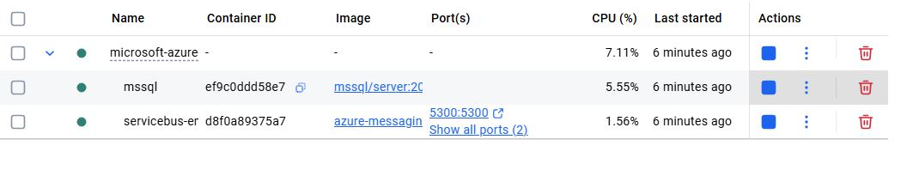

# Azure Service Bus Emulator - For Local Testing Queue &amp; Topic Setup

## Prerequisites
- Docker desktop
- Minimum hardware requirements:
  - 2 GB of RAM
  - 5 GB of disk space
- Windows Subsystem for Linux (WSL) configuration (only for Windows):
  - Install WSL
  - Configure Docker to use WSL

## Steps to follow the configuration
## Step 1
Download and Install the Docker Desktop on your lacal machine

Link - 
[Download Docker Desktop for Windows](https://desktop.docker.com/win/main/amd64/Docker%20Desktop%20Installer.exe?utm_source=docker&utm_medium=webreferral&utm_campaign=docs-driven-download-win-amd64&_gl=1*rbtxyg*_gcl_au*MTU1MDkwMjU4Ny4xNzU3MDg3Nzkw*_ga*NjEzMTAxMDUuMTc1NzA4NzMzOQ..*_ga_XJWPQMJYHQ*czE3NTcwODczMzgkbzEkZzEkdDE3NTcwODc3ODkkajYwJGwwJGgw)

## Step 2

- Clone this Repository
- Change the below Path as per your folder location in ".env" file

  CONFIG_PATH="E:\\RnD\Azure\\ServiceBus\\azureservicebusemulator\\Emulator\\config.json" 

## Step 3
To run emulator just run the below commond

**docker compose -f "E:\\RnD\\Azure\\ServiceBus\\azureservicebusemulator\\Emulator\\docker-compose.yaml" up -d**

After the steps are successful, you can find the containers running in Docker.

## Step 4

Now Its time for communicating with Queue and Topic runing on this container ...

From Publisher and Consumer/Subscriber Application we can utilize this local service bus.. 

only we need to use this configuration 

"Endpoint=sb://localhost;SharedAccessKeyName=RootManageSharedAccessKey;SharedAccessKey=SAS_KEY_VALUE;UseDevelopmentEmulator=true;"
